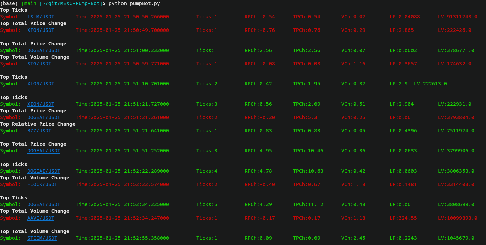

# Pump Bot for MEXC Exchange

This is a Python-based pump bot designed to monitor price changes on the MEXC cryptocurrency exchange using the CCXT library. It identifies top price changes, volume changes, and tick counts for USDT trading pairs.

## Screenshot



## How to Run

1. Clone this repository:
   ```bash
   git clone https://github.com/yourusername/pump-bot.git
   ```

2. Navigate to the project directory:
   ```bash
   cd pump-bot
   ```

3. Install dependencies:
   ```bash
   pip install -r requirements.txt
   ```

4. Create a `.env` file and add your MEXC API credentials:
   ```bash
   cp .env.example .env
   nano .env  # Edit the file with your API key and secret
   ```

5. Run the bot:
   ```bash
   python pumpBot.py
   ```

## Requirements

- Python 3.8+
- CCXT library
- Termcolor library

## .gitignore

The `.gitignore` file ensures that sensitive files like `.env` are not uploaded to GitHub.

## License

This project is licensed under the MIT License. See the [LICENSE](LICENSE) file for details.
